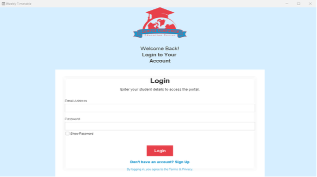
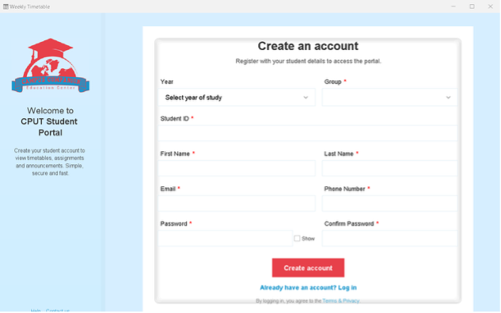
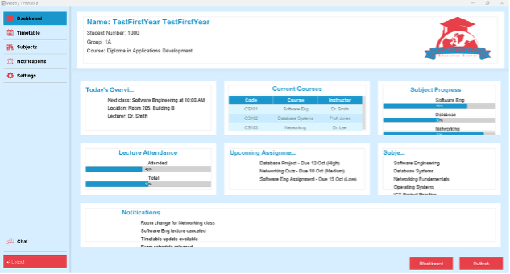

# StudentTimeTable Desktop Application

**Role:** Group Leader & Lead Front-End Designer  
I led the development of this project, coordinating the group and designing the main front-end of the entire application, ensuring a modern, user-friendly interface and seamless cross-platform experience.

----------
## Screenshots of the Project

<p align="center">
  
  <br>
  <sub>**Figure 1:** Screenshot of the login page</sub>
</p>

<p align="center">
  
  <br>
  <sub> **Figure 2:** Screenshot of the Student Sign-up page</sub>
</p>

<p align="center">
  
  <br>
  <sub> **Figure 3:** Screenshot of the student dashboard</sub>
</p>

-----

## 📌 Prerequisites

Before installing and running the **StudentTimeTable** application, ensure the following are installed on your system:

### 1. Java

**Version:** JDK 24 (Java SE 24)

**Check Installation:**

```bash
java -version
javac -version
```

**Install Java:**

-   **Oracle JDK 24:** [Download here](https://www.oracle.com/java/technologies/javase/jdk24-archive-downloads.html)
    
-   **OpenJDK 24:** [Download here](https://jdk.java.net/24/)
    
-   **Linux (Debian/Ubuntu) via terminal:**
    
```bash
sudo apt update
sudo apt install openjdk-24-jdk
```

-   **macOS (Homebrew) via terminal:**
    

```bash
brew install openjdk@24` 
```

### 2. Apache Derby (Embedded Database)

Used as the embedded database for offline storage.

**Check installation via terminal (if Derby scripts are included):**

```bash
java -jar derbyrun.jar sysinfo` 
```

**Install Derby:**

-   **Linux/macOS via terminal:**
    

```bash
wget https://downloads.apache.org/db/derby/db-derby-10.14.2.0/db-derby-10.14.2.0-bin.zip
unzip db-derby-10.14.2.0-bin.zip
``` 

-   **Windows:** [Download Apache Derby](https://db.apache.org/derby/derby_downloads.html)
    
-   **Maven Dependency (embedded in project):**
    

`<dependency> <groupId>org.apache.derby</groupId> <artifactId>derby</artifactId> <version>10.14.2.0</version> </dependency>` 

### 3. Python

**Version:** Python 3.12 or higher

**Check Installation:**

`python3 --version # or python --version` 

**Install Python:**

-   [Python Downloads](https://www.python.org/downloads/)
    
-   Ensure **“Add Python to PATH”** is selected during installation.
    

### 4. Python Packages

Install required Python dependencies using `pip`:

```bash
pip install chatterbot==1.0.5
pip install flask==2.3.6
pip install flask_cors==3.2.2` 
```

These packages power the embedded chatbot server in the application.

----------

## 🛠 Installation & Packaging

This section explains how to clone, build, and package the **StudentTimeTable** Java application into a standalone desktop app using `jpackage`.

### 0. Clone the Project

```bash
git clone https://github.com/YaseenKannemeyer/CampusCompanion.git cd CampusCompanion
```

### 1. Prerequisites

-   Ensure Java JDK 24 is installed and `java`/`javac` are available in PATH.
    
-   Apache Derby and Python dependencies are included in the app.
    
-   Application JAR ready (e.g., `StudentTimeTable-1.0.1-shaded.jar`).
    
-   Prepare an icon file:
    
    -   Windows: `icon.ico`
        
    -   macOS/Linux: `icon.png`
        

### 2. Package for Windows

`jpackage ^
  --type msi ^
  --name "StudentTimeTable" ^
  --app-version 1.0.1 ^
  --input target ^
  --main-jar StudentTimeTable-1.0.1-SNAPSHOT-shaded.jar ^
  --main-class mycput.ac.za.studenttimetable.AppLauncher ^
  --icon src/main/resources/icons/StudentIcon.ico ^
  --java-options "--enable-preview" ^
  --resource-dir target/classes ^
  --vendor "CPUT" ^
  --copyright "© 2025 CPUT"` 

This generates an EXE installer including the embedded JRE and all dependencies.

### 3. Package for macOS

`jpackage \
  --type dmg \
  --name "CampusCompanion" \
  --app-version 1.0.1 \
  --input target \
  --main-jar StudentTimeTable-1.0.1-SNAPSHOT-shaded.jar \
  --main-class mycput.ac.za.studenttimetable.AppLauncher \
  --icon src/main/resources/icons/StudentIcon.icns \
  --java-options "--enable-preview" \
  --resource-dir target/classes \
  --vendor "CPUT" \
  --copyright "© 2025 CPUT"` 

Distribute the DMG or .app bundle without requiring separate Java installation.

### 4. Package for Linux

`jpackage \
  --type deb \
  --name "StudentTimeTable" \
  --app-version 1.0.1 \
  --input target \
  --main-jar StudentTimeTable-1.0.1-SNAPSHOT-shaded.jar \
  --main-class mycput.ac.za.studenttimetable.AppLauncher \
  --icon src/main/resources/icons/StudentIcon.png \
  --java-options "--enable-preview" \
  --resource-dir target/classes \
  --vendor "CPUT" \
  --copyright "© 2025 CPUT"` 

Replace `--type deb` with `rpm` for RPM-based distributions or `app-image` for a universal AppImage.

### 5. Notes & Tips

-   `--input` folder should contain your JAR, icons, Derby DB folder, and Python embedded files.
    
-   Test each installer on a clean OS to verify the app runs without additional installations.
    
-   Use `--java-options "--enable-preview"` if using Java 24 preview features.
    
-   Windows EXE installer adds desktop/start menu icon.
    
-   macOS DMG allows drag-and-drop installation.
    
-   Linux DEB/RPM creates a desktop entry and icon.
    

----------

## 🗂 Project Structure

```graphql
├── db
│   └── Project2FinalDB
│       ├── log
│       ├── seg0
│       └── tmp
├── src
│   └── main
│       ├── java
│       │   ├── fonts/Poppins
│       │   └── mycput/ac/za/studenttimetable
│       │       ├── connection
│       │       ├── dao
│       │       ├── domain
│       │       └── resources/icons
│       └── resources
│           ├── icons
│           ├── Poppins
│           └── Vid
└── target
    ├── classes
    ├── generated-sources/annotations
    ├── maven-archiver
    └── maven-status/maven-compiler-plugin/compile/default-compile
```

----------

## 🔧 Maintenance & Updates

As the group leader, I coordinated updates and ensured the front-end remained consistent and user-friendly across all versions. Follow these steps to maintain the application:

### 1. Pull Latest Changes

`git pull origin main` 

### 2. Update Maven Dependencies

`mvn versions:display-dependency-updates
mvn versions:use-latest-releases` 

Verify that the app still compiles correctly after updates.

### 3. Update Python Dependencies

`pip install --upgrade flask chatterbot flask_cors
pip freeze > requirements.txt` 

### 4. Database Maintenance (Apache Derby)

-   Backup Derby database:
    

`cp -r db/Project2FinalDB db/backup/Project2FinalDB_$(date +%Y%m%d)` 

-   Use `ij` or SQL scripts for schema updates.
    
-   Track database versioning for each release.
    

### 5. Rebuild the Application

`mvn clean package` 

Generates a new JAR, e.g., `target/StudentTimeTable-1.0.2-shaded.jar`.

### 6. Repackage with `jpackage`

`jpackage \
  --input target/ \
  --name StudentTimeTable \
  --main-jar StudentTimeTable-1.0.2-shaded.jar \
  --main-class mycput.ac.za.studenttimetable.AppLauncher \
  --icon resources/icons/icon.png \
  --app-version 1.0.2 \
  --type dmg` 

Replace `--type` with `exe`, `dmg`, or `deb` for the target OS.

### 7. Tag and Push a New Release

`git add .
git commit -m "Release v1.0.2 - UI updates and dependency improvements" git tag v1.0.2
git push origin main --tags` 

### 8. Publish Release on GitHub

1.  Go to [GitHub Releases](https://github.com/YaseenKannemeyer/CampusCompanion/releases)
    
2.  Click **Draft a new release**
    
3.  Select the tag (e.g., `v1.0.2`)
    
4.  Upload packaged installer(s)
    
5.  Add release notes
    
6.  Click **Publish release**
    

### 9. General Maintenance Tips

-   Test updates on all platforms before publishing.
    
-   Keep JDK, Maven, and Python versions consistent with prerequisites.
    
-   Clean Maven build directory: `mvn clean`
    
-   Monitor security advisories for dependencies.
    
-   Backup Derby database before major releases.
    

> Following these steps ensures the **StudentTimeTable** app remains stable, secure, and fully functional. As the lead designer, I ensured the UI maintains a consistent, modern look across all platforms.
